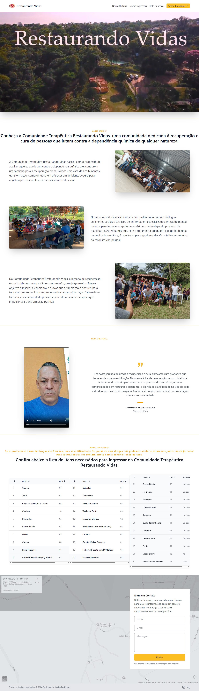

# Associação Restaurando Vidas - Impacto Social & Tecnologia 🕊️🧡

  

Este repositório contém o código-fonte do portal oficial da **Associação Restaurando Vidas**. O projeto foi desenvolvido com a missão de dar voz e visibilidade às ações sociais da instituição, servindo como uma ponte entre a causa e as pessoas que desejam ajudar.

## 🎯 Objetivo do Projeto
O foco principal foi o **Storytelling Social**. Em sites de ONGs, é fundamental que o usuário sinta a seriedade do trabalho e o impacto das ações. A arquitetura de informação foi planejada para facilitar o acesso à história da associação, aos projetos ativos e às formas de contribuição.

## 🚀 Tecnologias e Implementações
- **Frontend:** HTML5, CSS3 e JavaScript.
- **Design com Propósito:** Uso de uma identidade visual que transmite acolhimento, esperança e profissionalismo.
- **UX de Engajamento:** Estruturação de caminhos claros para quem deseja se tornar um parceiro, voluntário ou doador.
- **Transparência:** Seção dedicada à prestação de contas e apresentação dos resultados alcançados pela associação.

## 📂 Funcionalidades
- **Showcase de Projetos:** Galeria com as principais iniciativas e ações realizadas.
- **Institucional Completo:** Seção "Quem Somos" focada na missão, visão e valores da organização.
- **Área de Doação:** Fluxo simplificado para contribuições e apoio à causa.
- **Responsividade:** Interface otimizada para garantir que a mensagem da associação chegue a qualquer pessoa, em qualquer dispositivo.

## 🌐 Link do Projeto
Conheça o trabalho da associação: [assrestaurandovidas.org.br](https://assrestaurandovidas.org.br/)

---
Desenvolvido por **Maisa Rodrigues**
